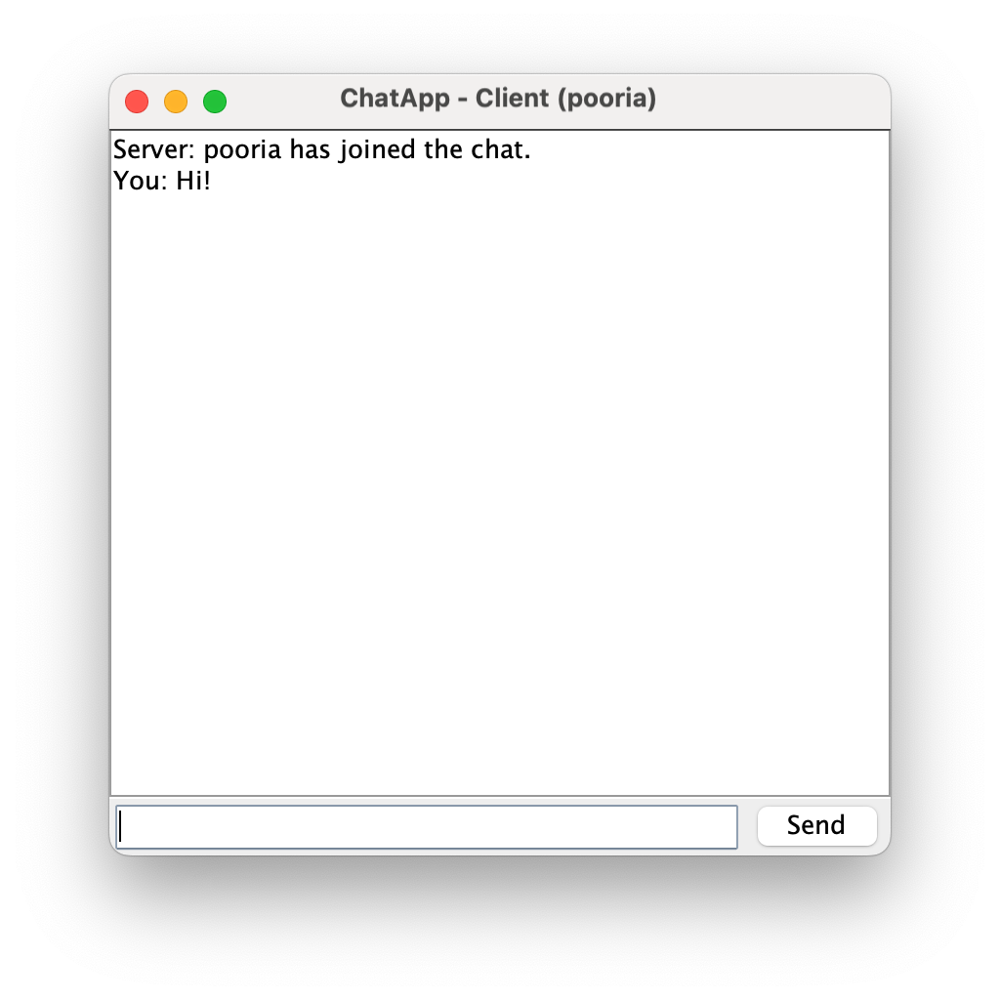

# ChatApp
Local Chat Application (Client-Server)

This project is a simple local chat app built using Java. It includes:
  •	ChatAppServer.java: A server that listens for multiple client connections using a ServerSocket. It manages client communications using multithreading, broadcasting messages to all connected clients.
	•	ChatAppClientGUI.java: A graphical client application built with Swing. Clients can connect to the server, send messages, and receive real-time updates from other users in the chat.

The app runs locally, with the server on localhost (port 1234 by default).

# Visual presentation of the app

